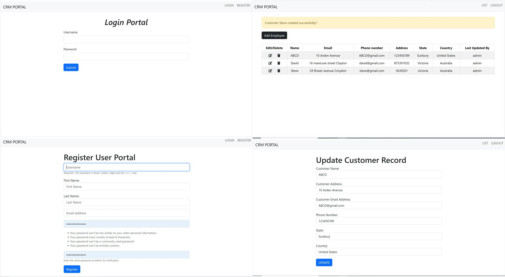

# CRM_Django
<h1>CRM Application designed using Django Python Framework</h1>
This CRM application maintains record of customer data and provides an option to user to add/edit/update and delete records from their portal. The employees need to register and sign in to access the portal. The CRM portal maintains the track of each customer record and the last update operation by employee.
  

Functionalities:
- Registeration
- Sign in 
- Add Customer record
- Edit Customer record
- Delete Customer record
- Update Customer record